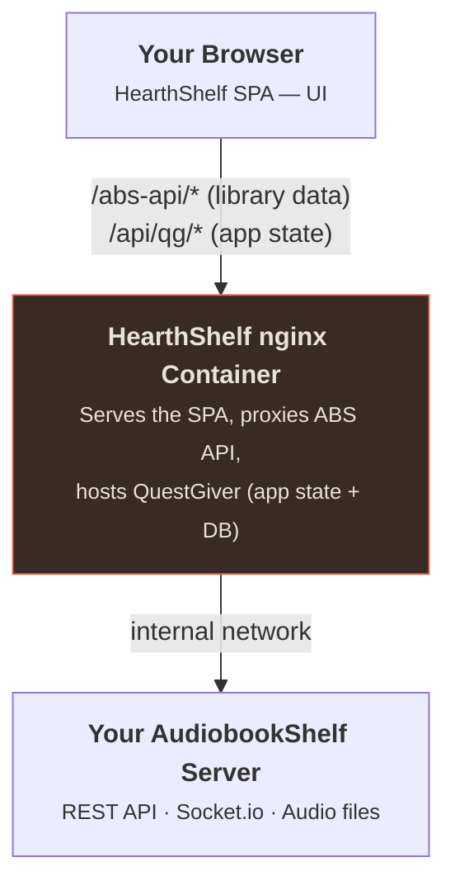

# What is HearthShelf?

HearthShelf is a **replacement UI for [AudiobookShelf](https://www.audiobookshelf.org/)** (ABS) — a self-hosted audiobook server you already run on your network.

| Field | Value |
|---|---|
| Domain | hearthshelf.com |
| Type | Static SPA served via nginx in a Docker container |
| Backend | Your AudiobookShelf server |
| Target | Browser (desktop-first, responsive) |
| Language | TypeScript |

## What it is

HearthShelf is **only the look**. Your AudiobookShelf server stays exactly where
it is and keeps doing everything it already does — holding your files, preparing
audio, and remembering where you left off. HearthShelf swaps the built-in
AudiobookShelf web page for a nicer, easier-to-use one.

Everything you see — your books, covers, and progress — comes from your
AudiobookShelf server. HearthShelf itself has:

- No file management
- No audio processing
- No copy of your library, progress, or listening history — those always live in AudiobookShelf

HearthShelf does keep a small backend of its own (QuestGiver) with an embedded
SQLite database for HearthShelf-specific state only - app settings, AI
recommendation config and history, and request/feedback data. It never
duplicates your ABS library.

## What it is not

HearthShelf does **not** replace AudiobookShelf. You still need AudiobookShelf
running to use it. Think of HearthShelf like a new skin or theme for your
audiobook server.

## The relationship

## Design direction

- **Dark by default** — warm near-neutral dark surfaces on a `#1b1a18` base
- **Ember accent** — a single warm accent color (`#e0654a`) used sparingly
- **Desktop-first** — designed for the browser, responsive enough for tablets
- **Libre Baskerville** brand wordmark — editorial serif for a warm, bookish feel

::: tip AudiobookShelf
HearthShelf is built on AudiobookShelf v2.x. Point the [slim image](/setup/docker) at a server you already run, or use the [all-in-one image](/setup/all-in-one), which bundles AudiobookShelf so you don't have to run it separately. [Learn about ABS.](https://www.audiobookshelf.org/)
:::
