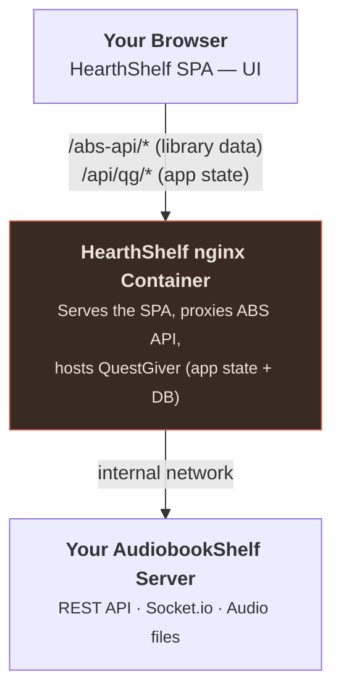

# What is HearthShelf?

HearthShelf is a **replacement UI for [AudiobookShelf](https://www.audiobookshelf.org/)** (ABS) — a self-hosted audiobook server you already run on your network.

| Field | Value |
|---|---|
| Domain | hearthshelf.com |
| Type | Static SPA served via nginx in a Docker container |
| Backend | Your AudiobookShelf server |
| Target | Browser (desktop-first, responsive) |
| Language | TypeScript |

## What it is

HearthShelf is **only the face**. Your ABS server stays exactly where it is and keeps doing everything it already does — managing your files, transcoding audio, tracking progress. HearthShelf replaces the web UI that ABS ships with a redesigned, browser-first experience.

All of your **library** data comes from ABS via its REST API. HearthShelf has:

- No file management
- No transcoding
- No copy of your library, progress, or sessions - those always live in ABS

HearthShelf does keep a small backend of its own (QuestGiver) with an embedded
SQLite database for HearthShelf-specific state only - app settings, AI
recommendation config and history, and request/feedback data. It never
duplicates your ABS library.

## What it is not

HearthShelf does **not** replace AudiobookShelf itself. You need a running ABS instance to use HearthShelf. Think of it as a theme — but one that runs as its own container.

## The relationship

## Design direction

- **Dark by default** — warm near-neutral dark surfaces on a `#1b1a18` base
- **Ember accent** — a single warm accent color (`#e0654a`) used sparingly
- **Desktop-first** — designed for the browser, responsive enough for tablets
- **Libre Baskerville** brand wordmark — editorial serif for a warm, bookish feel

::: tip AudiobookShelf
HearthShelf is built on AudiobookShelf v2.x. Point the [slim image](/setup/docker) at a server you already run, or use the [all-in-one image](/setup/all-in-one), which bundles AudiobookShelf so you don't have to run it separately. [Learn about ABS.](https://www.audiobookshelf.org/)
:::
