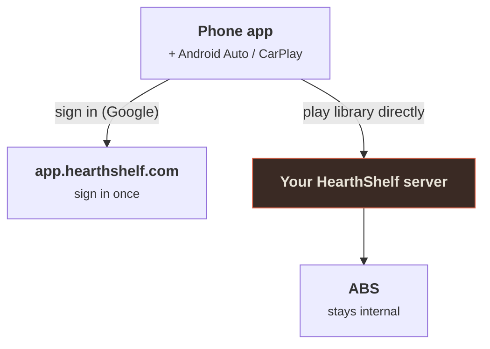

# The Mobile App

HearthShelf Mobile is the native phone app for HearthShelf. It signs in through the [hosted WebApp](/webapp/overview) (`app.hearthshelf.com`), connects to your linked server, and plays your audiobook library — including **in the car via Android Auto and CarPlay**.

::: warning In public beta
The mobile app is in **public beta on both Android and iOS**. You can join either beta today — Android through Play internal testing, iOS through TestFlight (see [Install](/mobile/install)). Expect rough edges and frequent changes. If you'd rather not run a beta, the native AudiobookShelf apps still work against your server unchanged — see the [FAQ](/guide/faq).
:::

## What it is

The same idea as the web experience, in your pocket:

- **One sign-in.** You authenticate once with the hosted WebApp (Google, via Clerk) and connect to the server you've been linked to — no server IP to type, no separate password. This is the exact flow the web app uses.
- **Background audio.** Playback keeps going with the screen off, with lock-screen and notification controls.
- **Offline downloads.** Download a book to the phone and listen with no connection at all. Progress you make offline syncs back to your server automatically once you're online again. See [Downloads & offline](#downloads-offline) for all the options.
- **In the car.** Browse and play your library from your car's screen — [Android Auto](/mobile/android-auto) on Android, [CarPlay](/mobile/carplay) on iOS. Both are real native car players, not a mirrored phone screen.

## How it connects

The app is a client of *your* server, exactly like the browser is. It never reaches into your server's internals or ABS directly.

After sign-in the phone talks **directly** to your HearthShelf server for library data and audio streaming. For this to work from anywhere, your server needs a reachable HTTPS address — the free [hs.direct address](/setup/remote-access) or your own domain both work.

## Downloads & offline

Download a book to your phone and it plays with no connection — on a plane, in a dead zone, or in the car. When the app can't reach your server on launch and you have at least one downloaded book, it opens straight into an **offline mode** so your downloads are still there to play. Anything you listen to offline is remembered and **synced back to your server automatically** the next time you're online. Everything about downloads lives on one screen: **Settings → Downloads & storage**.

### Downloading a book by hand

You choose exactly what to keep offline:

- **A single book** — open a book and tap **Download for offline**, or use the same action from the **⋯** menu on any book.
- **Several at once** — long-press a book to start selecting, pick more, and choose **Download for offline** from the toolbar. Handy for grabbing a whole series before a trip.

A progress ring shows on the cover while a book downloads. Manual downloads are always allowed — they ignore the storage cap below, because you asked for them on purpose.

### Downloading automatically

Prefer to not think about it? Turn on any of these rules and HearthShelf keeps the right books downloaded for you:

| Rule | What it does | Default |
| --- | --- | --- |
| **When you start a book** | Downloads a book for offline the moment you begin listening. | Off |
| **Continue Listening** | Keeps everything you've started downloaded, so your in-progress books are always offline-ready. | On |
| **Next in queue** | Downloads the next **1, 3, or 5** books coming up, so you're always a few ahead. | Off (0) |

Automatic downloads respect your storage cap — they pause once you hit it, and pick back up as space frees. (Manual downloads don't; those are your call.)

### Storage limits & cleanup

- **Maximum download space** — a slider from **Off (no limit)** up to **64 GB**. Auto-download stops adding books once your downloads reach this cap. A storage meter shows how much space your downloads use versus the rest of your device, and how much room auto-download has left before the cap.
- **Remove when finished** — on by default, this deletes a book's download as soon as you finish it, to free up space automatically. This one setting follows your account across devices; everything else about downloads is specific to the device the files are on.
- **Manage downloads** — the same screen lists every downloaded book with its size, lets you delete any of them, and lets you cancel a download that's still in progress.

Downloaded books stay in your library as normal — deleting a download only removes the offline copy, not the book.

## Platforms

| | Status |
| --- | --- |
| **Android** | Public beta via [Play internal testing](https://play.google.com/apps/internaltest/4701644118536911529). Android Auto supported. |
| **iOS** | Public beta via [TestFlight](https://testflight.apple.com/join/ehxv65Ms). Same React Native codebase; CarPlay supported. |

## What you need

- A HearthShelf server that is **reachable over HTTPS** (hs.direct or your own domain — a bare LAN IP won't work for the hosted sign-in flow).
- That server **linked to your `app.hearthshelf.com` account** — see [Linking & Invites](/webapp/pairing).
- An Android or iOS device (plus an Android Auto or CarPlay head unit if you want the car experience).

Then follow [Install](/mobile/install).

## Legal / disclaimer

HearthShelf is a user interface. It does not host, store, source, or distribute audiobooks, ebooks, or any other content, and it is not affiliated with AudiobookShelf. **You are responsible for the legality of any content you add to your library and for any backends or services you connect to HearthShelf.**
