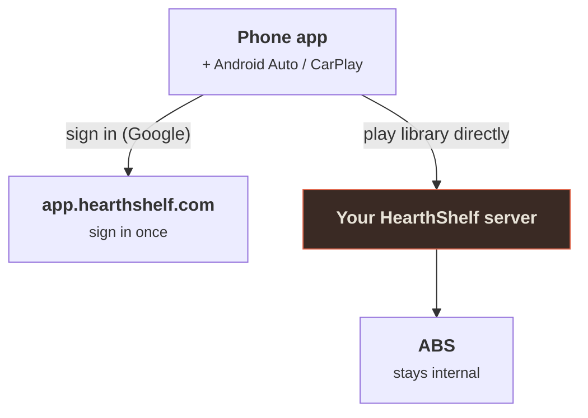

# The Mobile App

HearthShelf Mobile is the native phone app for HearthShelf. It signs in through the [hosted WebApp](/webapp/overview) (`app.hearthshelf.com`), connects to your linked server, and plays your audiobook library — including **in the car via Android Auto and CarPlay**.

::: warning In public beta
The mobile app is in **public beta on both Android and iOS**. You can join either beta today — Android through Play internal testing, iOS through TestFlight (see [Install](/mobile/install)). Expect rough edges and frequent changes. If you'd rather not run a beta, the native AudiobookShelf apps still work against your server unchanged — see the [FAQ](/guide/faq).
:::

## What it is

The same idea as the web experience, in your pocket:

- **One sign-in.** You authenticate once with the hosted WebApp (Google, via Clerk) and connect to the server you've been linked to — no server IP to type, no separate password. This is the exact flow the web app uses.
- **Background audio.** Playback keeps going with the screen off, with lock-screen and notification controls.
- **In the car.** Browse and play your library from your car's screen — [Android Auto](/mobile/android-auto) on Android, [CarPlay](/mobile/carplay) on iOS. Both are real native car players, not a mirrored phone screen.

## How it connects

The app is a client of *your* server, exactly like the browser is. It never reaches into your server's internals or ABS directly.

After sign-in the phone talks **directly** to your HearthShelf server for library data and audio streaming. For this to work from anywhere, your server needs a reachable HTTPS address — the free [hs.direct address](/setup/remote-access) or your own domain both work.

## Platforms

| | Status |
| --- | --- |
| **Android** | Public beta via [Play internal testing](https://play.google.com/apps/internaltest/4701644118536911529). Android Auto supported. |
| **iOS** | Public beta via [TestFlight](https://testflight.apple.com/join/ehxv65Ms). Same React Native codebase; CarPlay supported. |

## What you need

- A HearthShelf server that is **reachable over HTTPS** (hs.direct or your own domain — a bare LAN IP won't work for the hosted sign-in flow).
- That server **linked to your `app.hearthshelf.com` account** — see [Linking & Invites](/webapp/pairing).
- An Android or iOS device (plus an Android Auto or CarPlay head unit if you want the car experience).

Then follow [Install](/mobile/install).

## Legal / disclaimer

HearthShelf is a user interface. It does not host, store, source, or distribute audiobooks, ebooks, or any other content, and it is not affiliated with AudiobookShelf. **You are responsible for the legality of any content you add to your library and for any backends or services you connect to HearthShelf.**
