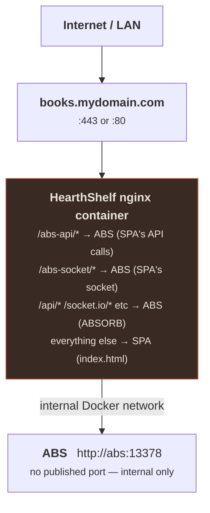

# Reverse Proxy

The transparent reverse-proxy model lets HearthShelf be the **only host** any end user touches — browser or native mobile app.

::: tip Just want public access, not a custom domain?
If you only need your server reachable from app.hearthshelf.com and don't care
about using your own domain, **hs.direct** does it with one setting and no proxy —
see [Remote Access](/setup/remote-access). This page is for running your **own
domain** through a transparent proxy (so ABSORB and the browser share one host).
:::

## Goal

End users interact exclusively with a single address (e.g. `books.mydomain.com`). Two different clients use it:

| Client | What it expects | How it reaches ABS |
|---|---|---|
| Web browser | The HearthShelf SPA | SPA at `/`, calls ABS through `/abs-api/*` prefix |
| ABSORB mobile app | A real ABS server | Native ABS paths (`/api/*`, `/socket.io/*`, streams) proxied transparently |

The non-technical user story: you hand your family a login plus the ABSORB app. To them, the website **is** HearthShelf and the mobile app **is** their audiobook app. They never see, type, or know the internal ABS address.

## Network Model



## Path Routing Table

| Path prefix | Owner | Notes |
|---|---|---|
| `/abs-api/*` | ABS | SPA's REST calls — strips prefix |
| `/abs-socket/*` | ABS | SPA's socket — strips prefix, websocket upgrade |
| `/api/*` | ABS | Native ABS REST (ABSORB) |
| `/socket.io/*` | ABS | Native ABS socket (ABSORB) |
| `/login`, `/logout` | ABS | Native ABS auth |
| `/auth/*` | ABS | OIDC initiation/callback |
| `/status`, `/healthcheck`, `/ping` | ABS | Health probes |
| `/public/*`, `/hls/*`, `/s/*`, `/feed/*` | ABS | Streams, HLS, RSS, share links |
| Everything else | HearthShelf SPA | `try_files ... /index.html` |

::: warning Keep SPA routes clear of ABS prefixes
HearthShelf's React Router routes (`/library`, `/book/:id`, etc.) must not overlap any reserved ABS path prefix above. They currently don't — but if you add a custom route, check the table first.
:::

## Docker Compose (Recommended)

```yaml
services:
  hearthshelf:
    image: ghcr.io/hearthshelf/hearthshelf:latest
    ports:
      - "443:443"   # or 80:80 if TLS terminates upstream
    environment:
      - ABS_SERVER_URL=http://abs:13378
      - PUBLIC_URL=https://books.mydomain.com
    depends_on: [abs]
    networks: [internal]

  abs:
    image: ghcr.io/advplyr/audiobookshelf:latest
    # NO ports: mapping — not reachable except via HearthShelf
    networks: [internal]
    volumes:
      - ./audiobooks:/audiobooks
      - ./config:/config
      - ./metadata:/metadata

networks:
  internal:
```

## TLS

TLS terminates at HearthShelf nginx (or at an upstream edge — Caddy, Traefik, Cloudflare Tunnel). The internal hop to ABS stays plain HTTP.

Whatever terminates TLS must forward `X-Forwarded-Proto: https` so ABS and the redirect rewrites emit correct `https://` URLs.

## Auth Redirect Rewriting

ABS sometimes emits absolute URLs in `Location` headers (OIDC redirects, etc.). If those carry the internal host, they break for users.

HearthShelf handles this two ways:

1. **Forwarded headers** — nginx sends `X-Forwarded-Host` and `X-Forwarded-Proto` so ABS generates correct absolute URLs itself.
2. **`proxy_redirect`** — nginx rewrites any remaining `Location` headers that still carry the internal ABS address to `PUBLIC_URL`.

Set `PUBLIC_URL` in your environment to enable redirect rewriting.

## OIDC Considerations

If you use OpenID Connect login:

- The `redirect_uri` sent to ABS must be `https://books.mydomain.com/oauth/callback` (your public URL)
- Add that URL to your OIDC provider's allowed-redirect list
- Add it to ABS's OpenID "Mobile Redirect URIs" list in ABS server settings
- The OIDC provider must use the public URL — never the internal ABS address

## Verification Checklist

- [ ] ABS has no published `ports:` — unreachable except via internal network
- [ ] Browser → `https://books.mydomain.com/` loads HearthShelf, `/abs-api/*` calls succeed
- [ ] ABSORB configured with only `https://books.mydomain.com` — logs in, streams audio, syncs progress
- [ ] No `Location` header or visible URL ever exposes the internal ABS address
- [ ] Websocket upgrades work for both `/abs-socket/*` (SPA) and `/socket.io/*` (ABSORB)
- [ ] OIDC login completes and callback returns to `books.mydomain.com` (if using OIDC)
