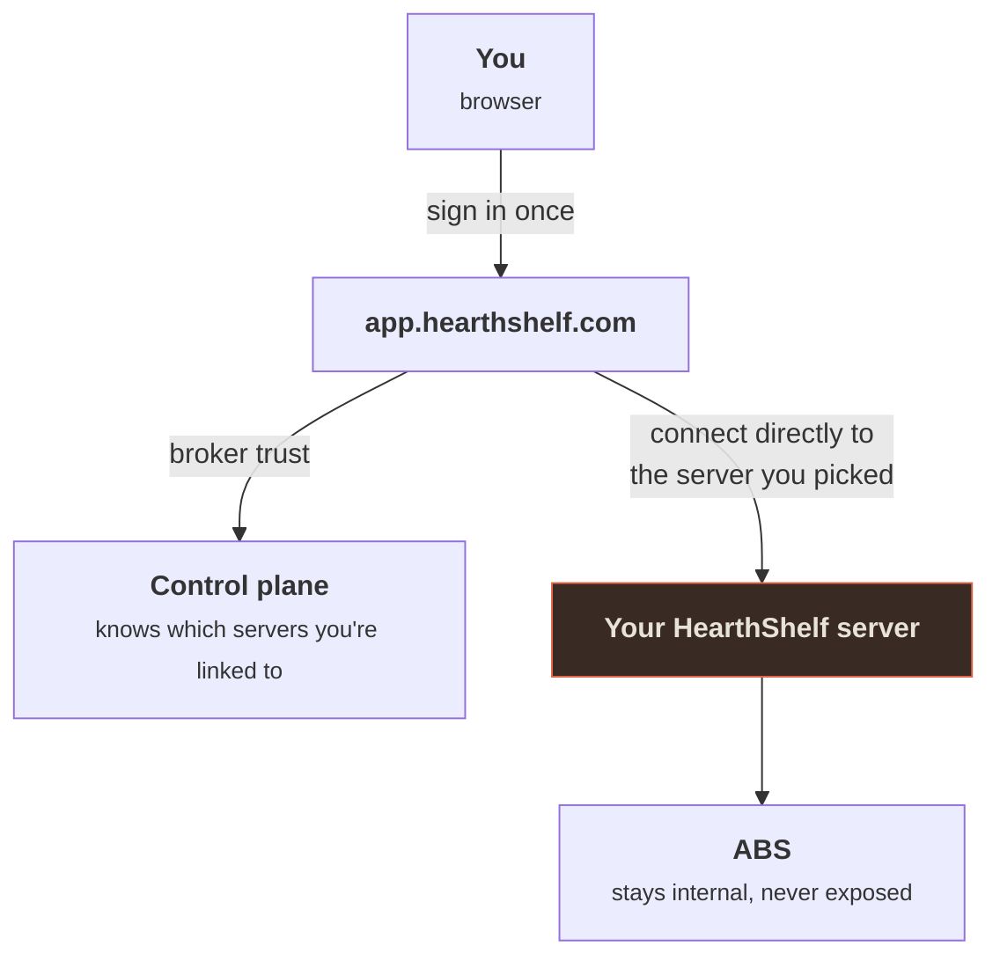

# The Hosted WebApp

`app.hearthshelf.com` is a **single front door** for HearthShelf — one URL, one sign-in, and access to every HearthShelf / AudiobookShelf server you've been invited to. It is the same idea as `app.plex.tv`: you authenticate once, pick a server, and you're in.

This is separate from the self-hosted HearthShelf container. You don't install the WebApp — it's a hosted service. What you self-host is your HearthShelf server (the AGPL SPA + QuestGiver in front of your ABS); the WebApp is just a client that connects to it.

## Why it exists

Self-hosting is powerful but the access story is awkward: every server has a different address, every user juggles a different login, and servers behind a firewall are hard to reach safely. The WebApp solves that with one promise:

> **You authenticate once and never see another auth screen.**

A family member you invite signs in at `app.hearthshelf.com`, and their library is just *there* — no internal IP to type, no second password to remember, no VPN to set up.

## How it relates to your server

The WebApp is an **arm's-length API client**. It talks to your HearthShelf server only over that server's public HTTP and Socket interfaces — exactly the way any other client does. It never reaches into your server's internals.

The control plane brokers *trust* — it tells your server "this is a verified user who's allowed here" — but it never carries your library traffic. Once you're connected, your browser talks **directly** to your HearthShelf server for everything: book data, audio streaming, live progress over Socket.io.

::: info Two codebases, one boundary
The hosted WebApp is proprietary and closed-source. It stays that way by never importing or copying from the AGPL-licensed HearthShelf server — it only speaks to it over the public API. That arm's-length boundary is what keeps the two projects legally independent. See [WebApp Architecture](/webapp/architecture).
:::

## What the WebApp adds

Compared to opening a single self-hosted HearthShelf directly, the WebApp gives you:

- **A server switcher** — jump between every server you have access to.
- **Sign in once** — federated identity (via Clerk) instead of one login per server.
- **Invite by email** — admins invite people the way Plex does; the invitee clicks, signs up, and lands in the library automatically.
- **Reachable servers behind a firewall** — your ABS can stay fully internal; only your HearthShelf gateway is exposed.
- **[Connect an AI app](/webapp/ai-apps)** — link Claude or another MCP-capable app to your library, read-only, and ask it whether a book fits you or what to read next.

The visual language is identical to the self-hosted app — same warm dark theme, same ember accent. The difference is the *shell*: a multi-server front door instead of a single-server UI.

## Legal / disclaimer

HearthShelf is a user interface. It does not host, store, source, or distribute audiobooks, ebooks, or any other content, and it is not affiliated with AudiobookShelf. **You are responsible for the legality of any content you add to your library and for any backends or services you connect to HearthShelf.**
